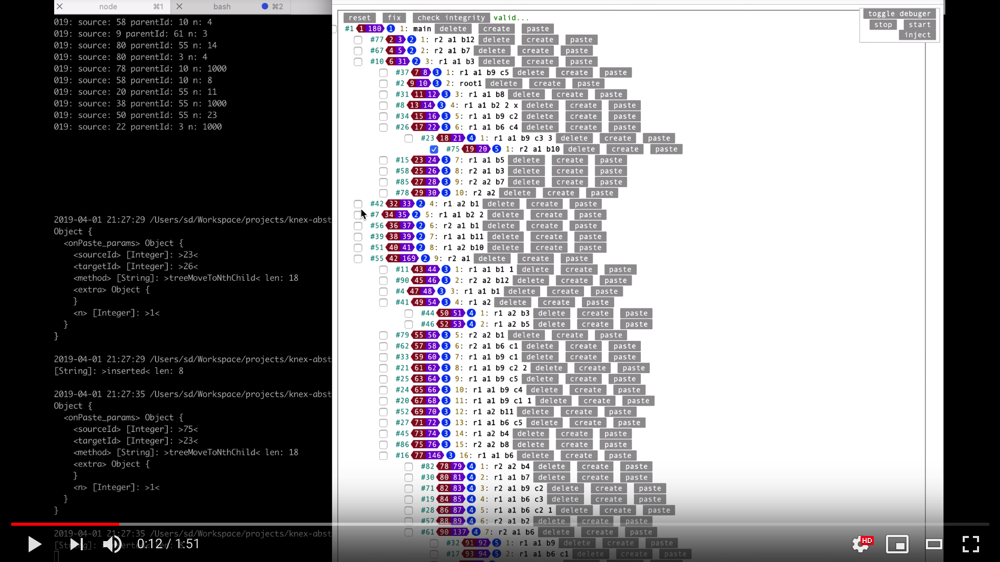

[](https://travis-ci.com/tomekwlod/knex-prototype)
[](https://badge.fury.io/js/knex-prototype)
[](https://codecov.io/gh/tomekwlod/knex-prototype/tree/v0.0.11)
[](https://github.com/knex-prototype/blob/master/LICENSE)


[](https://youtu.be/d8k98noOR5c)


# Installation:

    npx knex-prototype
    # follow instruction on the screen
    cd knex-project
    cat test.js
    # and see Makefile
    
# usege: 

    require('dotenv-up')(4, false, '.env');
    
    const knex              = require('knex-prototype');
    
    const config      = require('config');
    
    knex.init(config);
    
    (async function(){
    
        const list = await knex().model.common.raw('show tables');
        
        // ...
    
        
    })();
    
# examples:

See example of [config](models/config.js)

Follow:

 - [test cases](https://github.com/tomekwlod/knex-prototype/blob/master/test/knex/mysql/mysql-insert.test.js)
 - [test script](https://github.com/tomekwlod/knex-prototype/blob/master/example/test.js)
 
# Api

```javascript

import knex from 'knex-prototype';

const { Opt }           = knex.prototype;
// or import { Opt } from 'knex-prototype';

const prototype         = knex.prototype;

const a                 = prototype.a;

const man = knex().model.registered_manager_name;

(async function () {
    
    /**
     * Just helper to process parameters, return raw data as it is returned from native knex
     */
    const result = await man.raw(`select * from ...`, {...params});
    
    /**
     * The same like .raw() but it extracts proper response data
     * 
     * NOTE: Uses .raw() internally
     */
    const data1 = await man.query(`select * from ...`, {...params});
    
    /**    
     * the same like query but ... 
     * ... it will also pass data through fromDb()
     * 
     * uses internally fromDb();
     * 
     * NOTE: Uses .query() internally
     * 
     * uses: fromDb     
     */
    const data2 = await man.fetch(`select * from ...`, {...params});
    
    /**
     * Extract data 
     * @throws Error - if found more then one
     * @return undefined - if nothing found, object if found one
     * 
     * NOTE: Uses .query() internally
     * 
     * uses: fromDb     
     */
    const row1 = await man.queryOne(`select * from ...`, {...params});
    
    /**
     * Returns value from first column of first found row 
     * 
     * Extract data 
     * @throws Error - if found more then one
     * @return undefined - if nothing found, object if found one
     * 
     * NOTE: Uses .queryOne() internally - inherites .queryOne() throws
     * 
     * uses: fromDb 
     */
    const count1 = await man.queryColumn(`select count(*) c from ...`, {...params});
    
    /**
     * Count all rows in table
     * 
     * NOTE: Uses .queryColumn() internally - inherites .queryOne() throws
     * 
     * IT'S NOT USING: fromDb 
     */
    const count2 = await man.count();
    
    /**
     * Different version of queryOne that accept only 'select' of query and id in parameters
     * 
     * NOTE: Uses .queryOne() internally - inherites .queryOne() throws
     * 
     * uses: fromDb 
     */
    const row2 = await man.find(`id, title, ...`);
    
    /**
     * Returns all rows from table - quite ofthen useful if there is not many rows in table
     * 
     * NOTE: Uses .fetch() internally 
     * 
     * uses: fromDb 
     */
    const list1 = await man.findAll();
    
    /**
     * NOTE: Uses .query() internally
     * 
     * uses: toDb     
     */
    const newRowId = await man.insert({
        col1: 'col1 value',
        col2: 'col2 value',
        ...
    });
    
    /**
     * NOTE: Uses .query() internally
     * 
     * @param object entity
     * @param string|integer|object id
     * @return affectedRows
     * uses: toDb     
     */
    const affectedRows1 = await man.update({
        col1: 'col1 value',
        col2: 'col2 value',
        ...
    }, {id: 'idvalue'});
    
    /**
     * NOTE: Uses .query() internally
     * 
     * @param string|integer|object id
     * @return affectedRows
     */
    const affectedRows2 = await man.delete({id: 'idvalue'});
    
    /**
     * Create transaction internally if there is no trx object given in first parameter
     */
    await this.transactify(trx, async trx => {

        const id = await this.insert(trx, {
            title,
        });
    });
    
    /**
     * This way you are using internally .transaction() method on native knex object 
     */
    await this.transactify(async trx => {

        const id = await this.insert(trx, {
            title,
        });
    });
    
    /**
     * In order to stop passing data before and after fetching 
     * and puting to database through toDb and fromDb
     * there is a way to tell to ignore those functions
     */
    await this.find(Opt({
        fromDb  : false, // by default is true so always data are passed through fromDB if it's defined
        toDb    : false, // by default is true so always data are passed through toDb if it's defined
        both    : false, // disable passing through fromDb & toDb using one flag
    }), 1)
    
    /**
     * Flag to print all queries to the console 
     */
    await this.find(Opt({
        debug: true, // def: false, might be also number it will then 
        // define how deep log.dump() should inspect objects
    }), 1);
    
    /**
     * If debug flag is the only parameter that you want to pass use shortcut
     */
    await this.find(true, 1);
    
    
    
    /**
     * Example method of manager with cascading transaction
     */
    {
        // ...
        update: async function (...args) {
    
            let [debug, trx, entity, id] = a(args);
                
            return await this.transactify(trx, async trx => {
    
                if (Array.isArray(entity.roles)) {
        
                    await this.updateRoles(trx, id, entity.roles)
                }
        
                return prototype.prototype.update.call(this, debug, trx, entity, id);
            });
        },
        // ...
    }
    
}());

``` 

For more informations see [source code](src/mysql.js)

# Debugging and transactions

All above methods accept additional extra parameters:
 - debug - boolean (default false)
    parameter force to pring internal queries to the cli console
 - trx - function (default empty)
    optional parameter to pass outher transaction object in order to execute logic of specific method inside external transaction
    
types function and boolean are reserved for this two parameters in all above methods

Example use case: 
    
- [transactions](migrations/src/migration/1545125154513-auto.ts)

    
 
# Nested set

```javascript

// tags.js
const abstract          = require('knex-prototype');

const extend            = abstract.extend;

const prototype         = abstract.prototype;

const a                 = prototype.a;

const nestedset         = require('knex-prototype/nestedset');

const table             = 'tags';

const id                = 'id';

module.exports = knex => extend(knex, prototype, Object.assign(nestedset({
    columns: {
        l       : 'l',
        r       : 'r',
        level   : 'level',
        pid     : 'parent_id',
        sort    : 'sort',
    }
}), {
    initialize: () => {} // other custom methods
}), table, id);

``` 

And from now on manager will have extra available methods:

```javascript

const knex          = require('knex-prototype');

(async function () {
    

    const man = knex().model.tags;
        
    // this method will initialize columns level, sort, l, r
    // and if root already exist this method will check if it's valid
    const root = await man.treeInit({ 
        title: 'root'
    });
    
    // will find element with only id, parent_id, level, sort, l, r columns
    // columns will be normalized to regular names pid, level, sort, l, r even if real columns in 
    // database are different
    const node = await man.treeFindOne();
    
    // ... and others
    
    
    
        
    
})()

```

## Internal calls of methods

```javascript

const abstract          = require('knex-prototype');

const { Opt }           = abstract;

const extend            = abstract.extend;

const prototype         = abstract.prototype;

const a                 = prototype.a;

const table             = 'tags';

const id                = 'id';

const ns = nestedset({
    columns: {
        l       : 'l',
        r       : 'r',
        level   : 'level',
        pid     : 'parent_id',
        sort    : 'sort',
    }
})

module.exports = knex => extend(knex, prototype, Object.assign({}, ns, {
    update: async function (...args) {

        let [opt, trx, entity, id] = a(args);

        const {
            generatePathStop,
        } = opt;

        return await this.transactify(trx, async trx => {

            const ret = await prototype.prototype.update.call(this, opt, trx, entity, id);
            
            if ( generatePathStop !== true ) {

                await this.generatePath(Opt({
                    ...opt,
                    generatePathStop: true,
                }), trx, id);
            }

            return ret;
        });
    },

    treeDelete: async function (...args) {

        // standalone

        let [opt, trx, id] = a(args);

        return await this.transactify(trx, async trx => {
    
            const ret = await ns.treeDelete.call(this, ...args);

            await this.generatePath(opt, trx, id);

            return ret;
        });
    },

    treeMoveBefore: async function (...args) {
        // Calls internally treeMoveToNthChild 1-2
    },
    treeMoveAfter: async function (...args) {
        // Calls internally treeMoveToNthChild 1-2
    },


        treeCreateBefore: async function (...args) {
            // Calls internally treeCreateAsNthChild 1-3
        },
        treeCreateAfter: async function (...args) {
            // Calls internally treeCreateAsNthChild 1-3
        },


        treeMoveToNthChild: async function (...args) {
            // Calls internally treeCreateAsNthChild 2-3
        },
            treeCreateAsNthChild: async function (...args) {

                // standalone

                let [opt, trx, opt2 = {}] = a(args);

                return await this.transactify(trx, async trx => {

                    const ret = await ns.treeCreateAsNthChild.call(this, ...args);

                    await this.generatePath(opt, trx, opt2.sourceId);

                    return ret;
                });
            },
}), table, id);
```

# Single file example

```js

const path              = require('path');

const log               = require('inspc');

const knex              = require('knex-prototype');

const extend            = knex.extend;

const prototype         = knex.prototype;

const config            = require(path.resolve(__dirname, '..', 'ormconfig.js'));

knex.init({
    def: 'mysql',
    mysql: {
        client: 'mysql',
        connection: {
            host: config.host,
            port: config.port,
            user: config.username,
            password: config.password,
            database: config.database,
            charset: 'utf8',
            multipleStatements: true,
        },
        pool: {
            afterCreate: function (conn, cb) {
                conn.query(`SET SESSION sql_mode=(SELECT REPLACE(@@SESSION.sql_mode,'ONLY_FULL_GROUP_BY',''))`, function (err) {
                    cb(err, conn);
                });
            },
            "min": 2,
            "max": 6,
            "createTimeoutMillis": 3000,
            "acquireTimeoutMillis": 30000,
            "idleTimeoutMillis": 30000,
            "reapIntervalMillis": 1000,
            "createRetryIntervalMillis": 100,
        },
        acquireConnectionTimeout: 60000,
        models: new Proxy({
            common: knex => extend(knex, prototype, {}),
        }, {
            get(target, propKey, receiver) {

                if (typeof target[propKey] !== 'undefined') {

                    return target[propKey];
                }

                const keys = Object.keys(target);

                throw `No such mysql manager '${propKey}', registered managers are: ` + keys.join(', ');
            },
        }),
    }
});

(async function(){

    try {

        const man = knex().model.common;

        const migrationsTableName = config.migrationsTableName || 'migrations';

        let count = await man.queryColumn('select count(*) c from ??', [migrationsTableName]);

        process.stdout.write(String(count));
    }
    catch (e) {

        log.dump({
            mcountdb_catch_error: e,
        });
    }

    process.exit(0);

})();

```

# Dev notes

```bash

git clone https://github.com/tomekwlod/knex-prototype.git 
cd knex-prototype
make doc
sleep 10 # give little time for mysql docker to start
make ct
cp .env.dist .env
cp migrations/ormconfig.js.dist migrations/ormconfig.js
yarn
npm install --global nodemon
make link
make fixtures
make manual

# then if you run
make cc
# you can go to 
http://localhost:8080/
# to test manally

```

